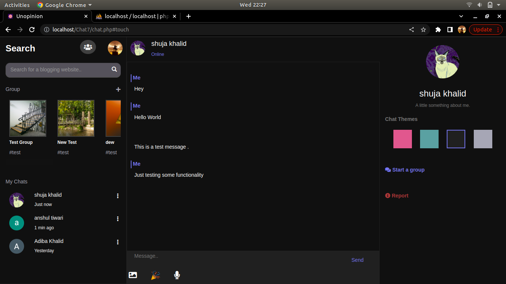
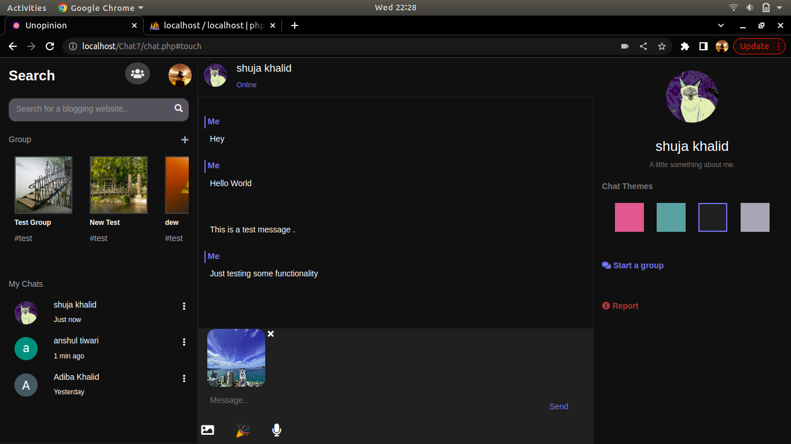
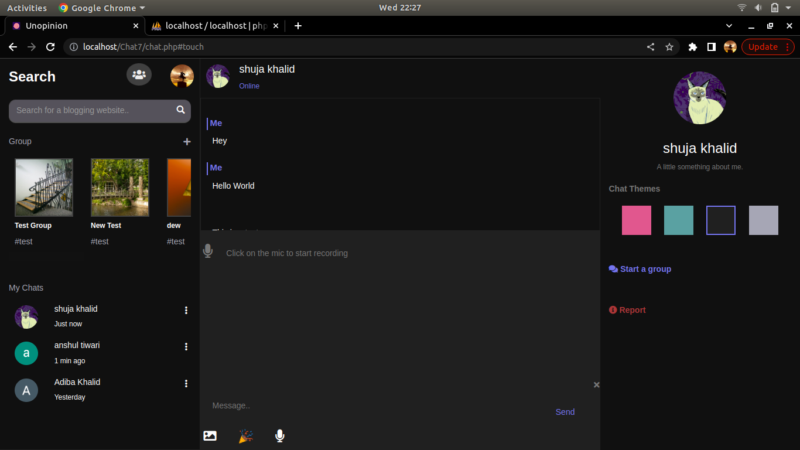
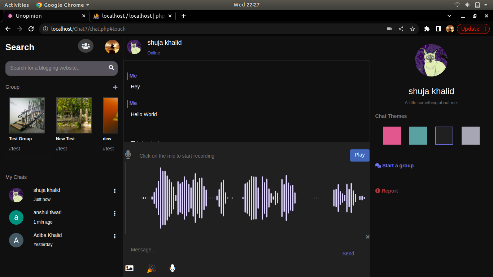
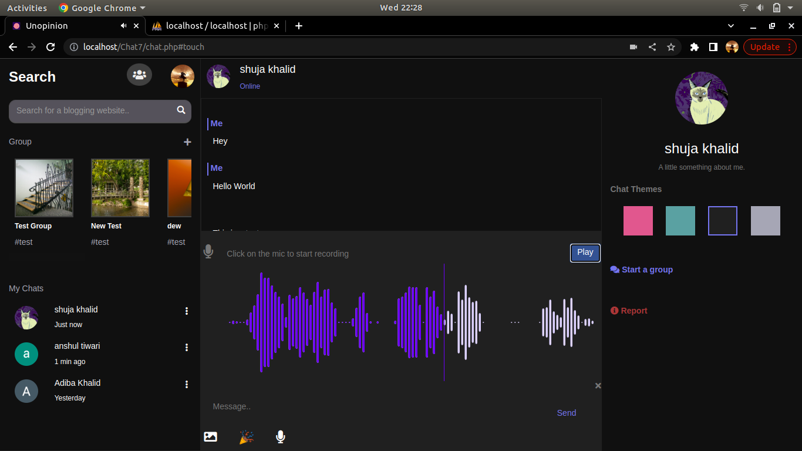
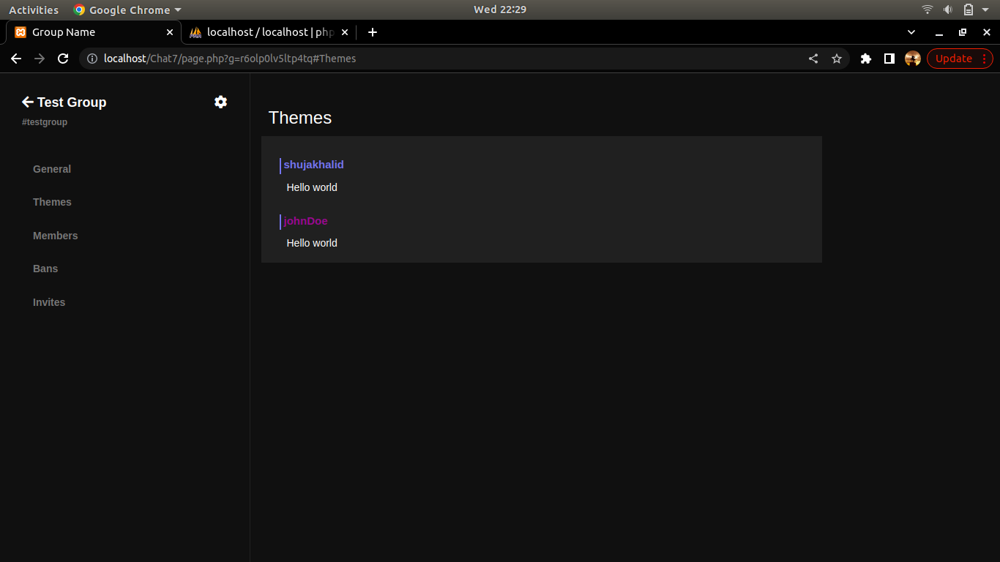
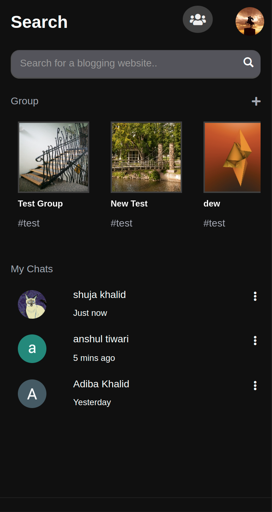
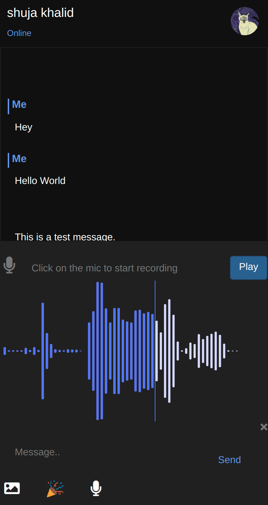
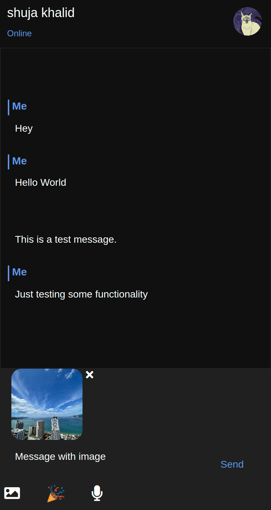
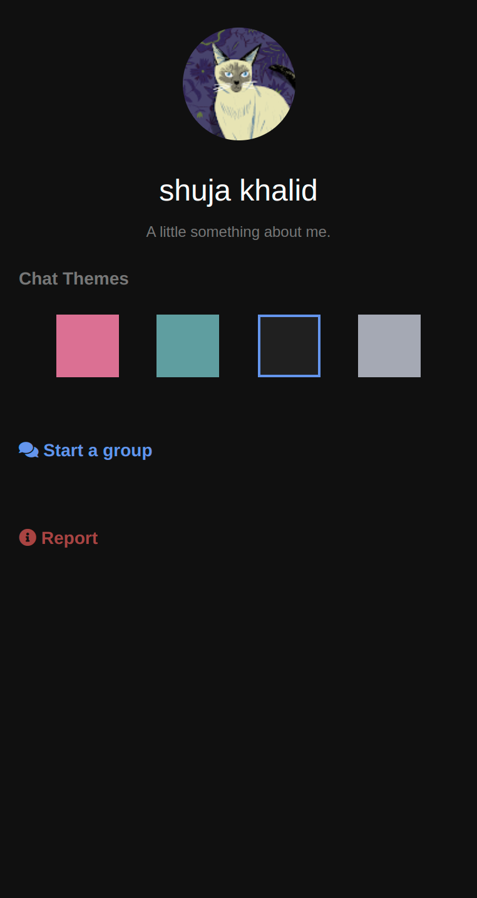

# Real Time Web Chat Application

An awesome web chat application which is both modern looking and user friendly built on top of Javascript, PHP and firebase with scalability in mind.This project is open to all interested in learning and innovating in the programming world.

AMA on my [discord server](https://discord.gg/PFqtwbVXMK)

## Backend ?

Backend code can be found within [requests/core](https://github.com/shujakhalid19/ChatApplication/tree/main/requests/core). 

## A Quick Overview
A project with scalabilty and modern design in mind consist of some exciting features such as Authentications and realtime messaging utilising Firebase services, user security was made possible by PHP and the  design and UX credits goes to CSS and JS respectively.The outstanding feature in this app is audio messaging made possible by Recorder.js and wavesurfer.js for audio wave frequencies.

  

# Desktop

### Home

### Share everyday pictures

### Record audio message and share within groups and friends

### Setting [Still working on it]

# Mobile
Overview of responsive design for smaller screen sizes.

  
  
  
  

